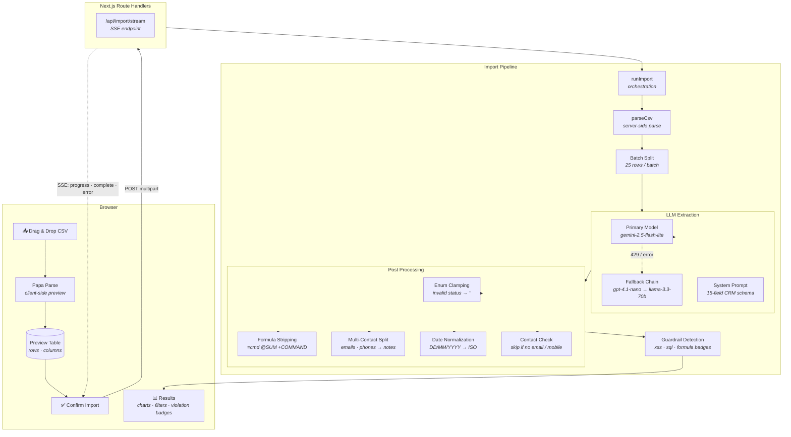

# CRMerge — End‑to‑End Architecture

## Technology Stack

| Layer | Choice |
|---|---|
| Framework | Next.js 15 (App Router) |
| Language | TypeScript |
| Styling | Tailwind CSS + shadcn/ui |
| AI Provider | OpenRouter (OpenAI‑compatible chat completions) |
| Primary Model | google/gemini-2.5-flash-lite |
| Fallback Models | openai/gpt-4.1-nano, meta-llama/llama-3.3-70b |
| CSV Parsing | Papa Parse (client + server) |
| Streaming | Server‑Sent Events (SSE) |
| Testing | Vitest |
